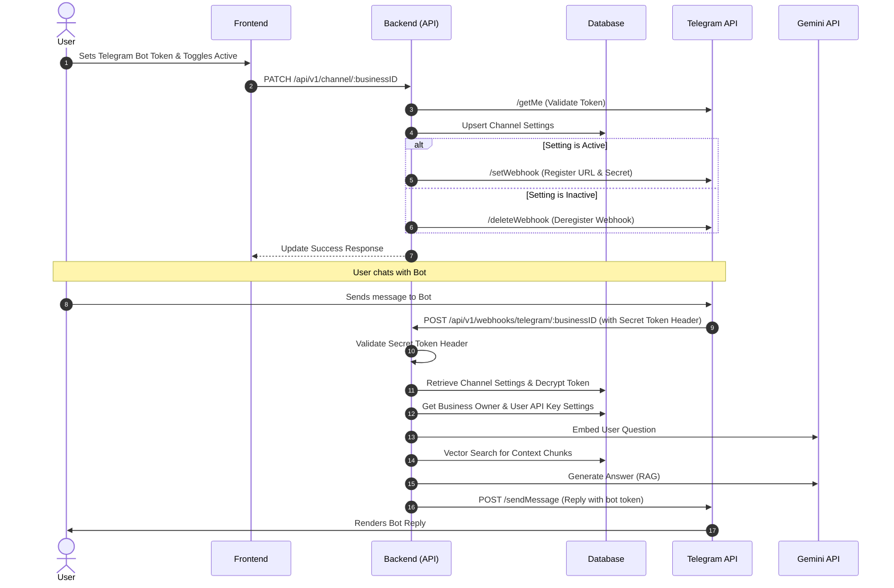

# Telegram Webhook Implementation Guide

This document outlines the step-by-step process to implement automated webhook registration and message processing for active Telegram bot tokens in our system.

---

## Architecture Overview




---

## Implementation Checklist

- **Step 1: Configuration Updates** (Add webhook base URL and webhook secret configuration)
- **Step 2: Extend Telegram Client** (Add HTTP calls for `SetWebhook` and `DeleteWebhook`)
- **Step 3: Add Vector Similarity Search in Repository** (For Retrieval-Augmented Generation)
- **Step 4: Automate Webhook Management in Settings Service** (Register/deregister webhook on settings Upsert & Delete)
- **Step 5: Implement Webhook Receiver Handler** (Validate secret token, query knowledge base, call Gemini, send answer)
- **Step 6: Register Webhook Route** (Expose public route for Telegram webhook calls)

---

## Step 1: Configuration Updates

### 1. Update `.env.example` & `.env`

Add variables for the public endpoint URL (e.g. from ngrok in development) and the secret token.

```ini
# Telegram Webhook
# In local development: use your ngrok / localtunnel HTTPS address
APP_BASE_URL=https://your-ngrok-subdomain.ngrok-free.app
```

### 2. Update [config.go](file:///Users/pamtechtech/Documents/work/side-projects/omni/apps/backend/internal/config/config.go)

Load `AppBaseURL` into the application configuration.

```diff
type Config struct {
	AppEnv      string
	Port        string
	DatabaseURL string

	// Telegram
	TelegramBotToken      string
	TelegramWebhookSecret string
+	AppBaseURL            string

	// Gemini
	...
}

func Load() (*Config, error) {
	...
	config := &Config{
		AppEnv:                 appEnv,
		Port:                   getEnv("PORT", "8080"),
		DatabaseURL:            dbURL,
		TelegramBotToken:       mustEnv("TELEGRAM_BOT_TOKEN"),
		TelegramWebhookSecret:  mustEnv("TELEGRAM_WEBHOOK_SECRET"),
+		AppBaseURL:             mustEnv("APP_BASE_URL"),
		GeminiAPIKey:           mustEnv("GEMINI_API_KEY"),
        ...
	}
    ...
}
```

---

## Step 2: Extend Telegram Client

We need to add methods in [client.go](file:///Users/pamtechtech/Documents/work/side-projects/omni/apps/backend/internal/integrations/telegram/client.go) to register and deregister webhooks dynamically using the bot token of a specific user/business.

### Modify [client.go](file:///Users/pamtechtech/Documents/work/side-projects/omni/apps/backend/internal/integrations/telegram/client.go)

Add `SetWebhook` and `DeleteWebhook` to the `TelegramClient` struct:

```go
// SetWebhook registers a public endpoint to receive incoming updates for a specific bot token.
func (t *TelegramClient) SetWebhook(ctx context.Context, token string, webhookURL string, secretToken string) error {
	url := fmt.Sprintf("https://api.telegram.org/bot%s/setWebhook", token)

	payload := map[string]string{
		"url": webhookURL,
	}
	if secretToken != "" {
		payload["secret_token"] = secretToken
	}

	jsonData, err := json.Marshal(payload)
	if err != nil {
		return fmt.Errorf("failed to marshal webhook payload: %w", err)
	}

	req, err := http.NewRequestWithContext(ctx, http.MethodPost, url, bytes.NewReader(jsonData))
	if err != nil {
		return fmt.Errorf("failed to create setWebhook request: %w", err)
	}
	req.Header.Set("Content-Type", "application/json")

	resp, err := t.httpClient.Do(req)
	if err != nil {
		return fmt.Errorf("failed to set webhook: %w", err)
	}
	defer resp.Body.Close()

	if resp.StatusCode != http.StatusOK {
		return fmt.Errorf("telegram api setWebhook returned status code %d", resp.StatusCode)
	}

	var body struct {
		Ok          bool   `json:"ok"`
		Description string `json:"description"`
	}
	if err := json.NewDecoder(resp.Body).Decode(&body); err != nil {
		return fmt.Errorf("failed to decode setWebhook response: %w", err)
	}

	if !body.Ok {
		return fmt.Errorf("telegram api setWebhook failed: %s", body.Description)
	}

	return nil
}

// DeleteWebhook deregisters webhook receiving for a specific bot token.
func (t *TelegramClient) DeleteWebhook(ctx context.Context, token string) error {
	url := fmt.Sprintf("https://api.telegram.org/bot%s/deleteWebhook", token)

	req, err := http.NewRequestWithContext(ctx, http.MethodPost, url, nil)
	if err != nil {
		return fmt.Errorf("failed to create deleteWebhook request: %w", err)
	}

	resp, err := t.httpClient.Do(req)
	if err != nil {
		return fmt.Errorf("failed to delete webhook: %w", err)
	}
	defer resp.Body.Close()

	if resp.StatusCode != http.StatusOK {
		return fmt.Errorf("telegram api deleteWebhook returned status code %d", resp.StatusCode)
	}

	var body struct {
		Ok          bool   `json:"ok"`
		Description string `json:"description"`
	}
	if err := json.NewDecoder(resp.Body).Decode(&body); err != nil {
		return fmt.Errorf("failed to decode deleteWebhook response: %w", err)
	}

	if !body.Ok {
		return fmt.Errorf("telegram api deleteWebhook failed: %s", body.Description)
	}

	return nil
}
```

---

## Step 3: Add Vector Similarity Search in Repository

To allow our chatbot to answer questions using business knowledge, we must implement vector semantic search in [knowledge_repository.go](file:///Users/pamtechtech/Documents/work/side-projects/omni/apps/backend/internal/repositories/knowledge_repository.go).

### Modify [knowledge_repository.go](file:///Users/pamtechtech/Documents/work/side-projects/omni/apps/backend/internal/repositories/knowledge_repository.go)

Add the method signature and implementation:

```go
type KnowledgeRepository interface {
	CreateChunk(ctx context.Context, businessKnowlege *model.BusinessKnowledge) error
	ReplaceChunksBySource(ctx context.Context, businessID uuid.UUID, sourceName string, chunks []model.BusinessKnowledge) error
	FindByBusinessID(ctx context.Context, businessID uuid.UUID, sourceTypes []model.SourceType) ([]model.BusinessKnowledge, error)
	DeleteUserSource(ctx context.Context, businessID uuid.UUID, sourceName string) error
	
	// Add this signature
	FindSimilarChunks(ctx context.Context, businessID uuid.UUID, queryEmbedding []float32, limit int) ([]model.BusinessKnowledge, error)
}

// Add this implementation
func (r *knowledgeRepository) FindSimilarChunks(ctx context.Context, businessID uuid.UUID, queryEmbedding []float32, limit int) ([]model.BusinessKnowledge, error) {
	var chunks []model.BusinessKnowledge
	vectorStr := pgvector.NewVector(queryEmbedding)

	// cosine distance operator (<=>) selects closest vector embeddings
	err := r.db.WithContext(ctx).
		Where("business_id = ? AND is_active = true", businessID).
		Order("embedding <=> ?", vectorStr).
		Limit(limit).
		Find(&chunks).Error

	return chunks, err
}
```

---

## Step 4: Automate Webhook Management in Settings Service

Modify [business_channel_settings_service.go](file:///Users/pamtechtech/Documents/work/side-projects/omni/apps/backend/internal/service/business_channel_settings_service.go) to trigger webhook activation when settings are updated or deactivated/deleted.

### Modify [business_channel_settings_service.go](file:///Users/pamtechtech/Documents/work/side-projects/omni/apps/backend/internal/service/business_channel_settings_service.go)

Update the `Update` and `Delete` methods as follows:

```go
func (s *businessChannelSetting) Update(ctx context.Context, businessID, userID uuid.UUID, req dto.UpdateBusinessChannelSettingDTO) (*model.BusinessChannelSetting, error) {
	if _, err := s.businessRepository.FindByIDAndUserID(ctx, businessID, userID); err != nil {
		return nil, err
	}

	existingSetting, err := s.businessChannelSettingRepository.FindByBusinessID(ctx, businessID)
	if err != nil && !errors.Is(err, gorm.ErrRecordNotFound) {
		return nil, err
	}

	hasNewToken := req.TelegramBotToken != nil
	hasActive := req.TelegramActive != nil

	var telegramActive bool
	var username string
	var encryptedToken string
	var plainBotToken string // Track plain text token to set up webhook

	if hasNewToken {
		plainBotToken = strings.TrimSpace(*req.TelegramBotToken)
		if plainBotToken == "" {
			return nil, apperrors.ErrInvalidTelegramBotToken
		}

		if !s.isValidTelegramToken(plainBotToken) {
			return nil, apperrors.ErrInvalidTelegramBotFormat
		}

		validationCtx, cancel := context.WithTimeout(ctx, 10*time.Second)
		defer cancel()
		username, err = s.telegramClient.ValidateBotToken(validationCtx, plainBotToken)
		if err != nil {
			return nil, apperrors.ErrInvalidTelegramBotToken
		}
		encryptedToken, err = utils.EncryptText(plainBotToken, s.cfg.EncryptionKey)
		if err != nil {
			return nil, err
		}

		if hasActive {
			telegramActive = *req.TelegramActive
		} else {
			telegramActive = true
		}
	} else {
		hasExistingToken := existingSetting != nil && existingSetting.TelegramBotTokenEncrypted != nil && *existingSetting.TelegramBotTokenEncrypted != ""

		if hasActive {
			if !hasExistingToken {
				return nil, apperrors.ErrTelegramBotTokenNotProvided
			}
			telegramActive = *req.TelegramActive
			encryptedToken = *existingSetting.TelegramBotTokenEncrypted
			if existingSetting.TelegramBotUsername != nil {
				username = *existingSetting.TelegramBotUsername
			}
		} else {
			if !hasExistingToken {
				return nil, apperrors.ErrTelegramBotTokenNotProvided
			}
			telegramActive = existingSetting.TelegramActive
			encryptedToken = *existingSetting.TelegramBotTokenEncrypted
			if existingSetting.TelegramBotUsername != nil {
				username = *existingSetting.TelegramBotUsername
			}
		}

		// Decrypt the existing token for webhook management calls
		if hasExistingToken {
			decryptedToken, err := utils.DecryptText(encryptedToken, s.cfg.EncryptionKey)
			if err != nil {
				s.logger.Error("failed to decrypt bot token during webhook toggle", zap.Error(err))
				return nil, err
			}
			plainBotToken = decryptedToken
		}
	}

	var id uuid.UUID
	if existingSetting != nil {
		id = existingSetting.ID
	}

	setting := &model.BusinessChannelSetting{
		ID:                        id,
		BusinessID:                businessID,
		TelegramBotUsername:       &username,
		TelegramBotTokenEncrypted: &encryptedToken,
		TelegramActive:            telegramActive,
	}

	if err := s.businessChannelSettingRepository.Upsert(ctx, setting); err != nil {
		return nil, err
	}

	// Dynamic Webhook Registration / Deregistration
	if plainBotToken != "" {
		webhookURL := fmt.Sprintf("%s/api/v1/webhooks/telegram/%s", s.cfg.AppBaseURL, businessID.String())
		if telegramActive {
			s.logger.Info("registering telegram webhook for bot", zap.String("business_id", businessID.String()), zap.String("url", webhookURL))
			// Call SetWebhook API
			if err := s.telegramClient.SetWebhook(ctx, plainBotToken, webhookURL, s.cfg.TelegramWebhookSecret); err != nil {
				s.logger.Error("failed to register telegram webhook", zap.Error(err))
				return nil, fmt.Errorf("failed to register webhook: %w", err)
			}
		} else {
			s.logger.Info("deactivating telegram webhook for bot", zap.String("business_id", businessID.String()))
			// Call DeleteWebhook API
			if err := s.telegramClient.DeleteWebhook(ctx, plainBotToken); err != nil {
				s.logger.Warn("failed to delete telegram webhook", zap.Error(err))
			}
		}
	}

	s.logger.Info("telegram bot token updated/toggled", zap.String("user_id", userID.String()), zap.String("business_id", businessID.String()))
	return setting, nil
}

func (s *businessChannelSetting) Delete(ctx context.Context, businessID, userID uuid.UUID) error {
	if _, err := s.businessRepository.FindByIDAndUserID(ctx, businessID, userID); err != nil {
		return err
	}

	// Clean up webhook before deleting database settings
	if setting, err := s.businessChannelSettingRepository.FindByBusinessID(ctx, businessID); err == nil && setting.TelegramBotTokenEncrypted != nil {
		if decryptedToken, err := utils.DecryptText(*setting.TelegramBotTokenEncrypted, s.cfg.EncryptionKey); err == nil && decryptedToken != "" {
			s.logger.Info("deleting webhook as channel setting is being removed", zap.String("business_id", businessID.String()))
			_ = s.telegramClient.DeleteWebhook(ctx, decryptedToken)
		}
	}

	return s.businessChannelSettingRepository.DeleteByBusinessID(ctx, businessID)
}
```

---

## Step 5: Implement Webhook Receiver Handler

Create a new file `internal/handler/telegram_webhook_handler.go` that processes webhook calls from Telegram. It parses the query, queries the knowledge base, formats the prompt for Gemini, and sends the answer back to the user.

### Create [telegram_webhook_handler.go](file:///Users/pamtechtech/Documents/work/side-projects/omni/apps/backend/internal/handler/telegram_webhook_handler.go)

```go
package handler

import (
	"context"
	"errors"
	"fmt"
	"net/http"
	"strings"
	"time"

	"github.com/devrapture/omni/internal/config"
	apperrors "github.com/devrapture/omni/internal/errors"
	"github.com/devrapture/omni/internal/integrations/gemini"
	"github.com/devrapture/omni/internal/integrations/telegram"
	"github.com/devrapture/omni/internal/model"
	"github.com/devrapture/omni/internal/repositories"
	"github.com/devrapture/omni/internal/utils"
	"github.com/gin-gonic/gin"
	"github.com/google/uuid"
	"google.golang.org/genai"
	"go.uber.org/zap"
	"gorm.io/gorm"
)

type TelegramWebhookHandler struct {
	businessRepo               repositories.BusinessRepository
	channelSettingRepo         repositories.BusinessChannelSettingsRepository
	knowledgeRepo              repositories.KnowledgeRepository
	userSettingRepo            repositories.UserSettingRepository
	telegramClient             *telegram.TelegramClient
	cfg                        *config.Config
	logger                     *zap.Logger
}

type TelegramUpdate struct {
	UpdateID int `json:"update_id"`
	Message  *struct {
		MessageID int `json:"message_id"`
		From      *struct {
			ID        int64  `json:"id"`
			IsBot     bool   `json:"is_bot"`
			FirstName string `json:"first_name"`
			LastName  string `json:"last_name"`
			Username  string `json:"username"`
		} `json:"from"`
		Chat *struct {
			ID   int64  `json:"id"`
			Type string `json:"type"`
		} `json:"chat"`
		Text string `json:"text"`
	} `json:"message"`
}

func NewTelegramWebhookHandler(
	br repositories.BusinessRepository,
	csr repositories.BusinessChannelSettingsRepository,
	kr repositories.KnowledgeRepository,
	usr repositories.UserSettingRepository,
	cfg *config.Config,
	logger *zap.Logger,
) *TelegramWebhookHandler {
	return &TelegramWebhookHandler{
		businessRepo:       br,
		channelSettingRepo: csr,
		knowledgeRepo:      kr,
		userSettingRepo:    usr,
		telegramClient:     telegram.NewTelegramClient(cfg),
		cfg:                cfg,
		logger:             logger,
	}
}

func (h *TelegramWebhookHandler) HandleWebhook(c *gin.Context) {
	businessID, err := uuid.Parse(c.Param("businessID"))
	if err != nil {
		h.logger.Warn("invalid business ID in webhook path", zap.String("business_id_param", c.Param("businessID")))
		c.Status(http.StatusBadRequest)
		return
	}

	// 1. Verify Secret Token header sent by Telegram
	headerSecret := c.GetHeader("X-Telegram-Bot-Api-Secret-Token")
	if headerSecret != h.cfg.TelegramWebhookSecret {
		h.logger.Warn("unauthorized webhook request: secret token mismatch", zap.String("business_id", businessID.String()))
		c.Status(http.StatusUnauthorized)
		return
	}

	var update TelegramUpdate
	if err := c.ShouldBindJSON(&update); err != nil {
		h.logger.Error("failed to bind webhook JSON payload", zap.Error(err))
		c.Status(http.StatusBadRequest)
		return
	}

	// 2. Ignore non-message updates or updates from bots
	if update.Message == nil || update.Message.Chat == nil || update.Message.From.IsBot {
		c.Status(http.StatusOK)
		return
	}

	ctx := c.Request.Context()
	chatID := fmt.Sprintf("%d", update.Message.Chat.ID)
	userText := strings.TrimSpace(update.Message.Text)

	// Don't reply to empty text
	if userText == "" {
		c.Status(http.StatusOK)
		return
	}

	// 3. Fetch Settings and Decrypt Token
	setting, err := h.channelSettingRepo.FindByBusinessID(ctx, businessID)
	if err != nil {
		if errors.Is(err, gorm.ErrRecordNotFound) {
			h.logger.Warn("webhook called but settings record not found", zap.String("business_id", businessID.String()))
			c.Status(http.StatusOK) // Return 200 to Telegram so it doesn't retry
			return
		}
		h.logger.Error("database query failed for settings", zap.Error(err))
		c.Status(http.StatusInternalServerError)
		return
	}

	if !setting.TelegramActive || setting.TelegramBotTokenEncrypted == nil {
		h.logger.Info("webhook called but telegram bot is inactive", zap.String("business_id", businessID.String()))
		c.Status(http.StatusOK)
		return
	}

	decryptedBotToken, err := utils.DecryptText(*setting.TelegramBotTokenEncrypted, h.cfg.EncryptionKey)
	if err != nil {
		h.logger.Error("failed to decrypt bot token in webhook response", zap.Error(err))
		c.Status(http.StatusInternalServerError)
		return
	}

	// Process message asynchronously to avoid blocking Telegram webhook response timeout
	go h.processMessageAndReply(businessID, chatID, userText, decryptedBotToken)

	c.Status(http.StatusOK)
}

func (h *TelegramWebhookHandler) processMessageAndReply(businessID uuid.UUID, chatID string, question string, botToken string) {
	ctx, cancel := context.WithTimeout(context.Background(), 30*time.Second)
	defer cancel()

	// 1. Load Business and User settings (to retrieve API keys)
	business, err := h.businessRepo.FindByID(ctx, businessID)
	if err != nil {
		h.logger.Error("failed to query business details", zap.Error(err))
		return
	}

	userSetting, err := h.userSettingRepo.FindByUserID(ctx, business.UserID)
	if err != nil {
		h.logger.Error("failed to query user settings for api key", zap.Error(err))
		return
	}

	// Decide on the Gemini API Key to use (custom key or platform key)
	geminiAPIKey := h.cfg.GeminiAPIKey
	if userSetting.Mode == model.AIKeyModeUserKey && userSetting.APIKeyEncrypted != "" {
		decryptedKey, err := utils.DecryptText(userSetting.APIKeyEncrypted, h.cfg.EncryptionKey)
		if err == nil {
			geminiAPIKey = decryptedKey
		}
	}

	// 2. Embed user question for similarity search
	embedClient, err := gemini.NewEmbeddingClient(ctx, geminiAPIKey)
	if err != nil {
		h.logger.Error("failed to create embedding client", zap.Error(err))
		return
	}

	queryEmbedding, err := embedClient.EmbedQuestion(ctx, question)
	if err != nil {
		h.logger.Error("failed to embed user question", zap.Error(err))
		return
	}

	// 3. Search nearest knowledge chunks
	chunks, err := h.knowledgeRepo.FindSimilarChunks(ctx, businessID, queryEmbedding, 5)
	if err != nil {
		h.logger.Error("failed to query vector database for similarity context", zap.Error(err))
		return
	}

	// Compile contexts
	var contextBuilder strings.Builder
	for idx, chunk := range chunks {
		contextBuilder.WriteString(fmt.Sprintf("[%d] Source: %s\nContent: %s\n\n", idx+1, chunk.SourceName, chunk.Content))
	}

	// 4. Ask Gemini for a response (RAG)
	genaiClient, err := genai.NewClient(ctx, &genai.ClientConfig{
		APIKey:  geminiAPIKey,
		Backend: genai.BackendGeminiAPI,
	})
	if err != nil {
		h.logger.Error("failed to create genai client", zap.Error(err))
		return
	}

	systemInstruction := fmt.Sprintf(
		"You are a helpful customer support bot representing %s. "+
			"Answer the user's question accurately using ONLY the business knowledge context provided below. "+
			"If the context doesn't contain the answer, politely tell the customer that you don't know the answer and will pass their request to a human representative.",
		business.Name,
	)

	prompt := fmt.Sprintf(
		"Context Chunks:\n%s\n"+
			"User Question:\n%s\n",
		contextBuilder.String(),
		question,
	)

	resp, err := genaiClient.Models.GenerateContent(
		ctx,
		"gemini-2.5-flash",
		genai.NewContentFromText(prompt, genai.RoleUser),
		&genai.GenerateContentConfig{
			SystemInstruction: genai.NewContentFromText(systemInstruction, genai.RoleSystem),
			Temperature:       genai.Ptr(0.3),
		},
	)
	if err != nil {
		h.logger.Error("failed to query gemini model for answer", zap.Error(err))
		return
	}

	answer := "Sorry, I am unable to answer that right now."
	if len(resp.Candidates) > 0 && len(resp.Candidates[0].Content.Parts) > 0 {
		if text, ok := resp.Candidates[0].Content.Parts[0].(genai.Text); ok {
			answer = string(text)
		}
	}

	// 5. Reply to user on Telegram using their custom token
	if err := h.telegramClient.SendMessage(ctx, chatID, answer); err != nil {
		h.logger.Error("failed to send reply via telegram sendMessage API", zap.Error(err))
	}
}
```

---

## Step 6: Register Webhook Route

Register the new public webhook route in [routes.go](file:///Users/pamtechtech/Documents/work/side-projects/omni/apps/backend/internal/routes/routes.go). This route must bypass authentication middleware since Telegram servers call it directly.

### Modify [routes.go](file:///Users/pamtechtech/Documents/work/side-projects/omni/apps/backend/internal/routes/routes.go)

Add the new handler to routes dependencies and map it:

```diff
type HandlerDependencies struct {
	AuthHandler                   *handlers.AuthHandler
	UserSettingsHandler           *handlers.SettingsHandler
	FileUploadHandler             *handlers.FileUploadHandler
	BusinessHandler               *handlers.BusinessHandler
	BusinessChannelSettingHandler *handlers.BusinessChannelSettingHandler
+	TelegramWebhookHandler        *handlers.TelegramWebhookHandler
}

func Setup(db *gorm.DB, deps HandlerDependencies, cfg *config.Config, logger *zap.Logger) *gin.Engine {
	utils.RegisterValidators()

	r := gin.New()
	r.Use(middleware.RequestLogger(logger))
	r.Use(gin.Recovery())
	v1 := r.Group("/api/v1")

	{
		v1.GET("/health", handlers.HealthHandler(db))
		
+		// Telegram Webhooks route (No Auth middleware needed)
+		v1.POST("/webhooks/telegram/:businessID", deps.TelegramWebhookHandler.HandleWebhook)

		// auth
		auth := v1.Group("/auth")
        ...
```

Remember to inject `TelegramWebhookHandler` when building dependencies in your main server entry point (`main.go` or router initialization wire-up).